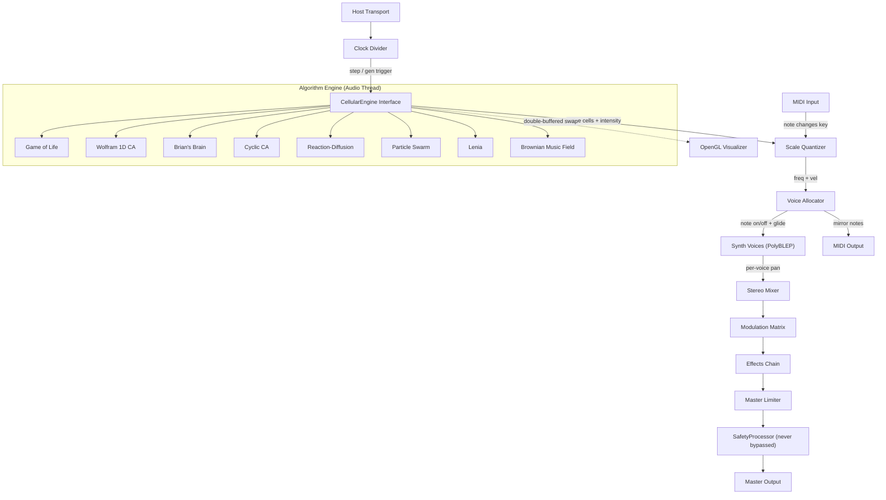

# Algo Nebula — Multi-Algorithm Generative Ambient Synthesizer

A JUCE VST3/Standalone plugin. Swappable cellular automata drive a polyphonic synthesizer, quantized to scales and tempo-synced. MIDI I/O. OpenGL 2D/3D visualization. Per-voice stereo field. Modulation matrix. Reorderable effects chain with ping-pong delay, phaser, flanger, chorus, reverb. Designed for ambient / generative music.

---

## Architecture



---

## Thread Safety Model

> [!CAUTION]
> Thread safety is architectural, not a feature to add later. These rules apply from Phase 1.

### Ownership Rules

| Thread | Owns | Reads |
|--------|------|-------|
| **Audio** | Grid truth, voice state, all DSP | Parameters (atomic read) |
| **OpenGL** | Render state | Grid snapshot (back buffer) |
| **UI (Message)** | Editor components | Parameter values |

### Mechanisms

- **Grid double-buffer**: Audio thread writes `gridFront`. On generation step, atomically swaps pointer with `gridBack`. GL thread always reads `gridBack`. No lock needed.
- **UI cell edits**: `juce::AbstractFifo` or lock-free SPSC queue. UI pushes `{row, col, state}` commands. Audio thread drains queue at start of `processBlock`.
- **Parameter access**: All continuous params via `std::atomic<float>` loaded by audio thread. APVTS `getRawParameterValue()` returns atomic pointer.
- **Parameter smoothing**: Every continuous parameter wrapped in `juce::SmoothedValue<float>` with appropriate ramp length. Initialized in `prepareToPlay()`.
- **Algorithm swap**: UI sets `std::atomic<int> pendingAlgorithm`. Audio thread checks at processBlock boundary, performs swap during silence gap (crossfade handles the transition).
- **No allocations on audio thread**: All buffers pre-allocated in `prepareToPlay()`. Grid resize queued via FIFO, executed with pre-allocated max-size grid.

---

## DAW Transport Behavior

| Event | Behavior | Rationale |
|-------|----------|-----------|
| **Play** | Start/resume GoL stepping and playhead | Normal operation |
| **Stop** | Pause GoL (freeze state), voices enter release | Musical: pattern preserved for re-play |
| **Loop start** | Reset grid to seed state, restart playhead at col 0 | Musical: consistent loop behavior |
| **Tempo change** | ClockDivider re-syncs smoothly (no hard reset) | Smooth transition, no clicks |
| **Host not playing** | Free-running internal clock (uses last known BPM or 120 default) | Standalone + preview mode |
| **Bypass** | All voices enter release, effects tail out, then silence | Clean bypass per VST3 spec |

---

## Algorithm Seeding + Persistence

### Seeding
- Every algorithm accepts a `uint64_t seed` parameter
- `randomize(density, seed)` produces identical patterns for same seed + density
- Seed is displayed in UI (copyable). User can paste a seed to reproduce a pattern.
- "New Seed" button generates a random seed

### Grid State Persistence
- `getStateInformation()` serializes:
  1. APVTS parameter XML
  2. Current grid state as base64-encoded binary blob (row-major, 1 bit per cell for binary CAs, 1 byte per cell for multi-state CAs)
  3. Current algorithm type + seed
  4. Cell age grid (compressed)
- `setStateInformation()` restores all of the above
- DAW project save/load fully preserves the exact grid state

### Factory Pattern Library
- Embedded presets per algorithm:
  - **GoL**: Glider, Pulsar, Gosper Gun, R-Pentomino, Acorn, Diehard, Spaceship, LWSS, Block, Blinker
  - **Wolfram**: Single center cell, random line, alternating, gradient
  - **Brian's Brain**: Random sparse, random dense, cross pattern
  - **Cyclic**: Random, spiral seed, stripe seed
  - **Reaction-Diffusion**: Center dot, random spots, stripe seed
  - **Particle**: Cluster, dispersed, ring
  - **Lenia**: Orbium (single creature), Geminium (splitting), smooth random
  - **Brownian**: Single walker, multi-walker cluster, correlated drift
- Accessed via dropdown in the grid panel

---

## Algorithm Catalog

### v1 Core Algorithms (8)

| # | Algorithm | Character | Key Params |
|---|-----------|-----------|------------|
| 1 | Game of Life | Pattern-based, settles to oscillators | Rule preset (B/S notation) |
| 2 | Wolfram 1D CA | Waterfall sequencer, 256 rule variants | Rule number (0-255) |
| 3 | Brian's Brain | Constant sparking, rhythmic pulses | (No extra params) |
| 4 | Cyclic CA | Rotating spirals, slow drones | State count, threshold |
| 5 | Reaction-Diffusion | Organic Turing patterns, glacial | Feed rate, kill rate |
| 6 | Particle Swarm | Flocking, wandering melodic lines | Count, speed, cohesion |
| 7 | **Lenia** | Continuous GoL. Smooth, organic, creature-like blobs that glide and pulsate. Floating-point cell values with Gaussian neighborhood kernels. Produces the richest intensity mapping of any algorithm. | Kernel radius, growth center, growth width, time step |
| 8 | **Brownian Music Field** | Seeded random walkers on the grid. Multiple walkers with correlated motion create drifting, ambient contours. Essentially a multi-voice random walk quantized to the grid. | Walker count (1-16), step size, correlation, drift bias |

### v2 Experimental Algorithms (Tier 1 — Priority)

| Algorithm | Character | Why Priority |
|-----------|-----------|-------------|
| **Slime Mold (Physarum)** | Agents deposit pheromone trails, sense and follow gradients. Creates organic branching networks that merge and split. Produces slowly evolving, interconnected melodic threads. | User priority. Organic branching = unique musicality |
| **Particle-Reactive Synth** | Extension of Particle Swarm: particles react to the audio output (envelope follower feeds back into particle behavior). Loud = scatter, quiet = cluster. Creates a feedback loop between sound and pattern. | User interest. True audio-reactive generative system |

### v2 Experimental Algorithms (Tier 2)

| Algorithm | Character |
|-----------|-----------|
| **Ising Model** | Spin lattice from physics. Temperature param controls randomness. Low temp = consonant, high temp = chaotic. Critical temperature = most musically interesting edge. |
| **Sand Pile (Abelian)** | Cells accumulate grains, topple at threshold, trigger avalanches. Power-law dynamics = natural crescendo/decrescendo. Avalanche size maps to note density. |
| **Wave Equation** | 2D wave propagation. Drop pebbles, ripples interfere. Wave height = note intensity. Creates evolving spatial harmonics. |
| **Langton's Ant** | State-machine walker that flips cells and turns. Multiple ants create emergent highways and chaotic regions. Sparse wandering + sudden dense clusters. |

### v3 Experimental Algorithms (Tier 3)

| Algorithm | Character |
|-----------|-----------|
| **Markov Chain Grid** | Each cell's next state is probabilistic based on neighbors. Tunable transition matrix — anywhere from deterministic (CA-like) to fully random. |
| **Predator-Prey** | Two populations (Lotka-Volterra) on a grid. Oscillating population waves. Maps to two timbres/ranges that ebb and flow. |
| **Neural CA** | Each cell is a tiny neural net with evolved weights. Self-organizing, self-repairing patterns. Trainable toward musical targets. |
| **DLA (Diffusion-Limited Aggregation)** | Random walkers stick to growing crystal. Branching tree structures. Growth front = active notes, interior = drones. |
| **L-System Grid** | Lindenmayer rewriting rules on 2D grid. Self-similar, recursive melodic structures. Counterpoint from mathematics. |

---

## Synthesis Engine

### Band-Limited Oscillators (PolyBLEP)

All non-sine waveshapes use PolyBLEP anti-aliasing to prevent aliasing artifacts:
- Saw, square/pulse, triangle generated with polynomial bandlimited step corrections
- Based on [martinfinke/PolyBLEP](https://github.com/martinfinke/PolyBLEP) port
- Triangle via integrated band-limited square

### Waveshapes (8)

| # | Name | Notes |
|---|------|-------|
| 1 | Sine | No BLEP needed |
| 2 | Triangle | Integrated BLEP square |
| 3 | Saw | BLEP corrected |
| 4 | Pulse | BLEP + **pulse width** param (0.1-0.9) |
| 5 | Sine + Octave | Additive |
| 6 | Fifth Stack | Fund + P5 + octave |
| 7 | Pad | Fund + detuned unison (+/- 7 cents) |
| 8 | Bell | FM inharmonic |

### Polyphony
- 1-8 voices, default 4
- Stealing: oldest, quietest, or drop new
- Unison: all voices on one pitch, detune spread 0-25 cents

### Ambient Voice Controls

| Param | Range | Default | Purpose |
|-------|-------|---------|---------|
| **Drone Sustain** | 0-100% | 0% | Probability that a note sustains through next step even after its cell dies. 100% = infinite drone machine. |
| **Note Probability** | 0-100% | 100% | Chance each triggered note actually fires. At 30%, sparse breathing patterns. |
| **Gate Time** | 0-100% (of step) | 80% | How long the note is held before entering release. Short gate + long reverb = ambient pluck-into-wash. |
| **Velocity Humanization** | 0-30% | 5% | Random jitter on algorithm-derived velocity. Prevents mechanical repetition. |
| **Rest Injection** | 0-50% | 0% | Probability that a given step produces no notes at all. Forces breathing space. (v2) |

### Humanization (v1)

| Param | Range | Default | Purpose |
|-------|-------|---------|---------|
| **Swing** | 50-75% | 50% | Timing offset on every other step. 50% = straight, 67% = classic swing. |
| **Strum / Note Spread** | 0-50ms | 0ms | When multiple cells fire simultaneously, spread onsets across this window. Prevents machine-gun stacking. |
| **Melodic Inertia** | 0-100% | 30% | Bias toward small intervals. At 100%, next note strongly prefers stepwise motion. Makes output sound like melodies. |
| **Round-Robin Variation** | 0-100% | 20% | Per note-on: random offset to filter cutoff (+/- 5%) and pitch (+/- 2 cents). No two notes sound identical. |

### Humanization (v2)

| Param | Purpose |
|-------|---------|
| **Musical Gravity** | Notes pulled toward tonic/fifth/third. Gravity param controls strength. Creates tonal center. |
| **Octave Doubling** | 0-30% probability a triggered note also fires +/- octave. Harmonic reinforcement. |
| **Accent Patterns** | Every Nth step gets velocity boost (+20-50%). Configurable N. Gives rhythmic pulse. |
| **Articulation Variation** | Auto-alternate staccato/legato based on density. Dense = shorter, sparse = longer. |
| **Velocity Curves** | Apply exp/log/S-curve shaping to algorithm-derived velocity. Changes dynamic feel. |
| **Register Rotation** | Periodically shift active octave range. Every N steps, shift quantizer octave window. |

### Sub-Oscillator
- Follows the **lowest active voice**, one or two octaves down (selectable)
- Always sine waveform
- Dedicated level knob (0-100%)
- Provides warmth and ground beneath the generative voices
- Processed through the same stereo mixer and FX chain

### Noise Layer
- Filtered noise mixed per voice: air/breath texture
- Noise type: white or pink (selectable)
- LP cutoff: 200Hz-8kHz
- Level: 0-20% of voice amplitude
- Adds analog warmth and human breath quality to tonal signal

### Portamento
- Time: 0-2000ms
- Mode: continuous (true portamento) or stepped (glissando through scale degrees)
- Legato: portamento only when voices overlap

### Envelope (AHDSR)
Attack (1ms-10s), Hold (0-5s), Decay (1ms-10s), Sustain (0-1), Release (1ms-10s). Default: 500ms/0/200ms/0.8/3s.

### Filter (per-voice SVF)
LP/HP/BP/Notch. Cutoff 20Hz-20kHz. Resonance 0-1.

### Vibrato LFO
Rate 0.1-10Hz, depth 0-100 cents.

### Arpeggiator
Off/Up/Down/UpDown/Random. Rate: 1/4, 1/8, 1/16, 1/32. Host-synced.

---

## Stereo Field

### Per-Voice Pan
- Each voice has a pan knob (-1 to +1)
- **Auto-pan mode**: Grid column position maps to stereo field (left col = L, right col = R)
- Equal-power panning law

### Grid-Position Panning
- When a cell triggers a note, its column position in the grid determines stereo placement
- Creates spatial movement as the playhead sweeps

### Stereo Drift
- Per-voice pan position slowly wanders over time
- Drift rate: 0-1Hz (Brownian or sine LFO selectable)
- Drift depth: 0-100% of pan range
- Creates a living stereo field where sounds float across the image

---

## Microtuning

| Tuning | Character |
|--------|-----------|
| **12-TET** (default) | Standard equal temperament |
| **Just Intonation** | Pure intervals, natural beating between notes |
| **Pythagorean** | Stacked fifths, medieval quality |
| **432Hz reference** | Alternative A4 reference pitch (vs default 440Hz) |

Reference pitch A4 adjustable (420-460Hz). Custom cent offset per scale degree planned for v2.

---

## Effects Chain

### Architecture: Popout Window

The effects chain is displayed in a **popout/detachable window** with:
- Reorderable FX slots (drag to reorder)
- Per-effect bypass toggle
- Per-effect mix (dry/wet)

### Default chain order:
```
Chorus -> Phaser -> Flanger -> Bitcrush -> Tape Sat -> Ping-Pong Delay -> Shimmer Reverb -> Limiter
```

### Effects

| Effect | Key Params | Notes |
|--------|-----------|-------|
| **Chorus** | Rate, depth, mix, **stereo width** | Stereo spread control |
| **Phaser** | Rate, depth, stages, feedback, mix, **ping-pong** | Stereo alternating phase |
| **Flanger** | Rate, depth, feedback, mix, **ping-pong** | Stereo alternating comb |
| **Bitcrush / Lo-Fi** | Bit depth (1-16), sample rate reduction, **lo-fi filter** (LP), mix | Retro degradation |
| **Tape Saturation** | Drive, warmth, mix | Gentle harmonic saturation via Airwindows tape-sim (MIT). Adds analog warmth. |
| **Ping-Pong Delay** | Division (synced), feedback, mix, **pan width**, LP on feedback | Bounces L-R-L-R |
| **Shimmer Reverb** | Size, damping, width, mix, **shimmer amount**, **shimmer pitch** (+1oct/+5th) | Pitch-shifted feedback creates ethereal ascending wash. THE ambient reverb sound. |
| **Master Limiter** | Threshold, release | Prevents clipping |

**Shimmer reverb** implementation: standard FDN/algorithmic reverb with a pitch-shifted (+1 octave or +perfect 5th, selectable) feedback path. Shimmer amount controls how much pitch-shifted signal is fed back vs dry reverb. At 0% shimmer amount, functions as a normal high-quality reverb.

**Tape saturation**: cherry-picked from Airwindows Consolidated. Soft-clipping curve with even-harmonic emphasis.

**Bitcrush** implementation: quantize sample amplitude to `2^bitDepth` levels, decimate by sample-and-hold at reduced rate. Lo-fi filter is a gentle one-pole LP to tame harsh aliasing when desired.

### Freeze
- **Freeze button** on the master bus: captures the current audio output and loops it infinitely as a sustaining pad
- Algorithm continues generating on top of the frozen layer
- Frozen layer has its own volume control and LP filter (to darken over time)
- Unfreeze: frozen layer fades out over 2 seconds
- Implementation: circular buffer capture + crossfade loop point

---

## Safety Processor

> [!CAUTION]
> This stage is **always active, never bypassable, and has no user controls**. It exists solely to protect ears and speakers from algorithmic runaway.

### Signal Chain (post-Master Limiter)

```
Master Limiter output -> DC Offset Filter -> Ultrasonic Filter -> Brickwall Limiter -> DAC
```

| Stage | Implementation | Purpose |
|-------|---------------|--------|
| **DC Offset Filter** | One-pole HP at 5Hz | Removes DC drift from algorithms (esp. Reaction-Diffusion). Prevents speaker cone excursion and headroom waste. |
| **Ultrasonic Filter** | Gentle 2nd-order LP at 20kHz | Catches aliasing residue from PolyBLEP edge cases and bitcrush. Protects tweeters. |
| **Brickwall Limiter** | Airwindows `ClipOnly2` (MIT) at **-0.3 dBFS true peak** | Zero-latency true-peak clipping. Transparent when not engaged. If this limiter is doing audible work, something has gone wrong upstream. |

### Design Rules
- `SafetyProcessor` is instantiated in `PluginProcessor` constructor, not in the effect chain
- It processes **after** the master limiter, **before** the output buffer is returned to the host
- No APVTS parameters — hardcoded thresholds only
- Cannot be reordered, removed, or bypassed
- Initialized in `prepareToPlay()` with sample rate awareness

---

## Modulation Matrix (Popout Window)

A **popout/detachable window** with a routing grid:

### Mod Sources (4 initially, expandable)
1. **LFO 1** — Rate (0.01-20Hz), shape (sine/tri/saw/S&H), depth
2. **LFO 2** — Same
3. **Cell Intensity** — Current cell's age/neighbor count (0-1)
4. **Envelope Follower** — Follows the output amplitude

### Mod Destinations (any continuous parameter)
- Filter cutoff, resonance
- Pan, volume
- Effect params (chorus rate, delay feedback, reverb size, shimmer amount, etc.)
- Pulse width
- Portamento time
- Vibrato depth/rate
- **Timing offset** (per-step onset shift, replaces static jitter with LFO-driven groove)
- Gate time
- Drone sustain

### Routing
- Each source can target multiple destinations
- Each routing has a depth/amount control (-1 to +1)
- Max 8 active routings in v1

---

## Algorithm Crossfade

When switching algorithms:
1. New algorithm engine is instantiated (from pre-allocated pool)
2. New engine receives the current seed and initializes
3. Both engines run simultaneously for the crossfade duration (default 1 second)
4. Output = `(1-t) * oldEngine + t * newEngine` where t ramps 0->1
5. Old engine is released after crossfade completes
6. Voices from old engine enter release; new engine's voices start with attack

No silence gap. No clicks. Smooth musical transition.

---

## UI Design System

> [!IMPORTANT]
> The UI must feel premium and modern from Phase 1. No placeholder styling — `NebulaLookAndFeel` is built alongside the first editor.

### Typography

| Usage | Font | Weight | Notes |
|-------|------|--------|-------|
| Labels, headers, menus | **Inter** | Regular/Medium/SemiBold | Google Fonts, OFL license |
| Numeric readouts, values | **JetBrains Mono** | Regular | Monospaced, tabular figures |
| Seed display | JetBrains Mono | Light | Fixed-width for copy/paste |

Fonts embedded as binary resources via `BinaryData`. No system font dependencies.

Default palette shown below ("Deep Nebula" theme). All colors are theme-driven, not hardcoded.

| Token | Hex | Usage |
|-------|-----|-------|
| `bg-deep` | `#0A0E1A` | Main background |
| `bg-panel` | `#111827` | Panel backgrounds |
| `bg-surface` | `#1F2937` | Card/section surfaces |
| `accent-primary` | `#6366F1` | Active controls, highlights |
| `accent-glow` | `#818CF8` | Glow halos, hover states |
| `accent-hot` | `#F472B6` | Peak meters, warnings |
| `text-primary` | `#F9FAFB` | Primary text |
| `text-secondary` | `#9CA3AF` | Labels, inactive |
| `grid-alive` | `#34D399` | Active cells |
| `grid-dead` | `#1F2937` | Dead cells |
| `grid-age-ramp` | `#34D399` -> `#6366F1` -> `#F472B6` | Cell age gradient |

### Custom Components (`NebulaLookAndFeel`)

Inherits `juce::LookAndFeel_V4`. Overrides:

- **`NebulaDial`** (rotary knob): Arc indicator with gradient fill (`accent-primary` -> `accent-glow`). Outer glow ring via `melatonin_blur` (gaussian blur on accent-colored arc image). Value readout in JetBrains Mono centered below. Hover: glow intensifies. Drag: arc animates smoothly.
- **`NebulaSlider`** (linear slider): Rounded track with gradient fill. Thumb with subtle drop shadow. Value tooltip on hover.
- **`NebulaToggle`** (on/off switch): Pill-shaped with animated slide. Glow when active.
- **`NebulaComboBox`**: Dark dropdown with hover highlight, rounded corners.
- **`NebulaTabBar`**: Segmented control style, active tab has bottom accent bar with glow.

### Glow + Shadow Effects

- **[melatonin_blur](https://github.com/sudara/melatonin_blur)** (MIT): GPU-accelerated gaussian blur for shadows and glow halos on knobs, active controls, and the playhead.
- Glow applied by rendering control highlight to offscreen `juce::Image`, blurring, then compositing beneath the control.
- Playhead column on grid gets a vertical glow stripe.

### Animation

- `juce::ComponentAnimator` or `juce::Timer`-driven interpolation for:
  - Knob/slider value changes (lerp to target, ~60fps)
  - Algorithm crossfade progress bar
  - Grid cell birth/death fade (opacity ramp over 2-3 frames)
  - Panel open/close (slide + fade)
  - MIDI learn flash (pulsing glow on learned control)
- All animations use `juce::SmoothedValue` or manual lerp — no blocking.

### DPI / Scaling

- All drawing uses relative coordinates (no fixed pixel sizes)
- `juce::Desktop::getGlobalScaleFactor()` respected
- Font sizes defined as scale-relative constants
- Minimum editor size: 900x600, resizable with aspect ratio lock

### Theme System

`NebTheme` struct holds all color tokens + aesthetic flags. `NebulaLookAndFeel` reads from the active theme.

| Theme | Vibe | Accent | Aesthetic Flags |
|-------|------|--------|----------------|
| **Deep Nebula** (default) | Dark space, ambient | `#6366F1` / `#F472B6` | Standard glow |
| **Synthwave Sunset** | Retro neon, 80s | `#A855F7` / `#F97316` | Scanlines, retro grid floor, gradient horizon, chrome headers |
| **Void** | Minimal, near-black | `#0D9488` / `#2DD4BF` | Subtle glow, muted |
| **Solar Flare** | Warm dark, ember | `#F59E0B` / `#EF4444` | Intense glow |

#### Synthwave Aesthetic Elements (active when Synthwave Sunset theme selected)
- **Retro grid floor**: 3D terrain mode renders neon wireframe lines on dark ground (classic perspective grid)
- **Gradient horizon**: Panel backgrounds with subtle purple->pink->orange horizontal gradient
- **Neon glow**: Increased `melatonin_blur` radius and intensity on all controls
- **Scanlines**: Optional subtle horizontal scanline overlay (1px lines at 50% opacity, every 2px)
- **Chrome/neon headers**: Section headers with gradient-fill text (Inter SemiBold with accent gradient)

#### User Themes
- User-created themes via JSON file in plugin data directory
- JSON schema: all color tokens + boolean aesthetic flags
- Theme selector in settings panel

---

## MIDI Learn System

### Interaction

1. **Right-click** any knob, slider, toggle, or combo box
2. **Popup menu** appears with:
   - "MIDI Learn" — enter learn mode
   - "Clear MIDI Assignment" — remove current mapping
   - "MIDI Channel: [1-16/Omni]" — filter channel
   - Current assignment shown (e.g., "CC 74 on Ch 1")
3. In learn mode:
   - Control pulses with `accent-glow` animation
   - "Waiting for MIDI CC..." tooltip
   - First incoming CC message is captured and assigned
   - Learn mode auto-cancels after 10 seconds or on Escape

### Architecture

```
MidiLearnManager
├── mappings: Map<ParameterID, {CC, Channel}>
├── learnTarget: atomic<ParameterID?>
├── processIncoming(MidiBuffer&)  // called from processBlock
├── startLearn(paramID)
├── clearMapping(paramID)
├── serialize() / deserialize()   // saved with plugin state
```

- `processBlock` scans MIDI buffer for CC messages. If `learnTarget` is set, captures first CC. Otherwise, applies mapped CC values to corresponding parameters.
- Mappings serialized in `getStateInformation()` alongside grid state and APVTS.
- CC value (0-127) mapped to parameter's `NormalisableRange` via linear interpolation.
- 14-bit CC support (CC pairs) for fine resolution where available.

### Visual Feedback

- Mapped controls show a small MIDI icon badge (top-right corner)
- Badge color: `accent-primary` when receiving, `text-secondary` when idle
- Parameter value updates from MIDI CC animate the knob/slider smoothly (via SmoothedValue)

---

## OpenGL Visualization

Uses `juce::OpenGLContext` with GLSL shaders. Reference: Gin `gin_3d` for camera math.

| Mode | Description |
|------|-------------|
| **2D Grid** | Color cells (age gradient), playhead glow, note highlights |
| **3D Terrain** | Height-mapped mesh, orbit camera, gen-interpolation |
| **Wireframe** | Same mesh, line-rendered |

Grid state read from double-buffered back copy (no lock). GL thread renders at 30-60fps independent of audio.

> [!NOTE]
> User is developing a WebGPU JUCE integration layer. When available, rendering will migrate from OpenGL to WebGPU. The visualizer abstraction (`AlgoVisualizerComponent`) should be designed with a backend-agnostic rendering interface to facilitate this future swap.

---

## Third-Party Dependencies

| Library | License | Purpose |
|---------|---------|---------|
| **JUCE 8** | GPLv3 / Commercial | Framework, DSP, OpenGL |
| **Gin** | BSD | Plugin utils, `gin_3d` camera/matrix, oscillators |
| **DaisySP** | MIT | MoogLadder, additional DSP primitives |
| **Airwindows Consolidated** | MIT | ~400 effects via `airwin-registry` CMake target |
| **Signalsmith DSP** | MIT | Header-only delay utilities, FDN reverb |
| **melatonin_blur** | MIT | GPU-accelerated gaussian blur for glow/shadow effects |
| **Inter** | OFL | UI label/header font (embedded binary) |
| **JetBrains Mono** | OFL | Numeric readout font (embedded binary) |

> [!NOTE]
> Airwindows `airwin-registry` and `AirwinRegistry.h` are MIT-clean for closed-source use. Only the DAW-plugin wrappers introduce GPL. We use the raw DSP processing classes, not the plugin wrappers.

---

## Project Structure

```
algo-nebula/
├── CMakeLists.txt
├── src/
│   ├── PluginProcessor.h/.cpp
│   ├── PluginEditor.h/.cpp
│   ├── engine/
│   │   ├── CellularEngine.h              # Interface
│   │   ├── GameOfLife.h/.cpp
│   │   ├── WolframCA.h/.cpp
│   │   ├── BriansBrain.h/.cpp
│   │   ├── CyclicCA.h/.cpp
│   │   ├── ReactionDiffusion.h/.cpp
│   │   ├── ParticleSwarm.h/.cpp
│   │   ├── Lenia.h/.cpp                  # Continuous GoL
│   │   ├── BrownianField.h/.cpp          # Random walkers
│   │   ├── ScaleQuantizer.h/.cpp
│   │   ├── ClockDivider.h/.cpp
│   │   ├── VoiceAllocator.h/.cpp
│   │   ├── AlgorithmCrossfader.h/.cpp
│   │   ├── MidiInputHandler.h/.cpp
│   │   ├── MidiOutputGenerator.h/.cpp
│   │   └── PatternLibrary.h/.cpp          # Factory patterns
│   ├── synth/
│   │   ├── PolyBLEPOscillator.h/.cpp
│   │   ├── SynthVoice.h/.cpp
│   │   ├── SubOscillator.h/.cpp           # Follows lowest voice
│   │   ├── NoiseLayer.h/.cpp              # Per-voice filtered noise
│   │   ├── WaveShapes.h
│   │   ├── Microtuning.h/.cpp             # Tuning tables + reference pitch
│   │   └── Arpeggiator.h/.cpp
│   ├── fx/
│   │   ├── EffectChain.h/.cpp             # Reorderable slot system
│   │   ├── ChorusEffect.h/.cpp
│   │   ├── PhaserEffect.h/.cpp
│   │   ├── FlangerEffect.h/.cpp
│   │   ├── PingPongDelay.h/.cpp
│   │   ├── BitcrushEffect.h/.cpp          # Lo-fi / retro
│   │   ├── TapeSaturation.h/.cpp          # Airwindows tape-sim
│   │   ├── ShimmerReverb.h/.cpp           # FDN + pitch-shifted feedback
│   │   ├── FreezeProcessor.h/.cpp         # Circular buffer freeze
│   │   ├── MasterLimiter.h/.cpp
│   │   └── SafetyProcessor.h/.cpp         # DC + ultrasonic + brickwall
│   ├── mod/
│   │   ├── ModulationMatrix.h/.cpp
│   │   ├── LFOSource.h/.cpp
│   │   ├── StereoDrift.h/.cpp             # Brownian/LFO pan wander
│   │   └── EnvelopeFollower.h/.cpp
│   └── ui/
│       ├── NebTheme.h                     # Theme struct + factory themes
│       ├── NebulaLookAndFeel.h/.cpp       # Master theme (reads NebTheme)
│       ├── NebulaColours.h                # Color token constants
│       ├── NebulaDial.h/.cpp              # Rotary knob with glow
│       ├── NebulaSlider.h/.cpp            # Linear slider
│       ├── NebulaToggle.h/.cpp            # Animated on/off
│       ├── NebulaComboBox.h/.cpp          # Styled dropdown
│       ├── MidiLearnManager.h/.cpp        # CC mapping engine
│       ├── MidiLearnOverlay.h/.cpp        # Right-click popup
│       ├── AlgoVisualizerComponent.h/.cpp
│       ├── GridOverlay.h/.cpp
│       ├── AlgorithmSelector.h/.cpp
│       ├── ScaleSelector.h/.cpp
│       ├── KnobPanel.h/.cpp
│       ├── EffectChainWindow.h/.cpp       # Popout
│       └── ModMatrixWindow.h/.cpp         # Popout
├── resources/
│   ├── fonts/
│   │   ├── Inter-*.ttf
│   │   └── JetBrainsMono-*.ttf
│   └── icons/
│       └── midi_badge.svg
├── shaders/
│   ├── grid_vertex.glsl
│   ├── grid_fragment.glsl
│   ├── terrain_vertex.glsl
│   └── terrain_fragment.glsl
├── test/
│   └── HeadlessTest.cpp
├── README.md, CHANGELOG.md, STATE.md
├── ROADMAP.md, ARCHITECTURE.md, HOWTO.md
```

---

## Parameters (APVTS)

<details>
<summary>Full parameter table (click to expand)</summary>

| Category | Parameter | Range | Default |
|----------|-----------|-------|---------|
| **Algorithm** | Type | enum 0-5 | GoL (0) |
| Algorithm | GoL rule preset | enum 0-4 | Ambient (2) |
| Algorithm | Wolfram rule | 0-255 | 110 |
| Algorithm | Cyclic states | 3-16 | 6 |
| Algorithm | Cyclic threshold | 1-8 | 1 |
| Algorithm | RD feed | 0.01-0.1 | 0.055 |
| Algorithm | RD kill | 0.01-0.08 | 0.062 |
| Algorithm | Particle count | 4-32 | 8 |
| Algorithm | Particle speed | 0.1-2.0 | 0.5 |
| Algorithm | Particle cohesion | 0-1 | 0.5 |
| Algorithm | Seed | uint64 | random |
| Algorithm | Crossfade time | 100-3000ms | 1000 |
| **Grid** | Rows | 4-32 | 12 |
| Grid | Cols | 4-64 | 16 |
| Grid | Preset | enum | Standard |
| Grid | Density | 0-1 | 0.3 |
| Grid | Hysteresis | 1-5 | 2 |
| Grid | Sustain steps | 0-4 | 1 |
| **Clock** | Playhead div | enum | 1/4 |
| Clock | Gen div | 1-16 | 4 |
| **Scale** | Root | enum 0-11 | D |
| Scale | Type | enum 0-14 | Pent Min |
| Scale | Base octave | 1-6 | 3 |
| Scale | Span | 1-4 | 2 |
| **Voice N** | Waveshape | enum 0-7 | Sine |
| Voice N | Pulse width | 0.1-0.9 | 0.5 |
| Voice N | Attack | 1ms-10s | 500ms |
| Voice N | Hold | 0-5s | 0 |
| Voice N | Decay | 1ms-10s | 200ms |
| Voice N | Sustain | 0-1 | 0.8 |
| Voice N | Release | 1ms-10s | 3s |
| Voice N | Filter mode | LP/HP/BP/Notch | LP |
| Voice N | Cutoff | 20-20kHz | 5000 |
| Voice N | Resonance | 0-1 | 0.3 |
| Voice N | Level | 0-1 | 0.7 |
| Voice N | Pan | -1 to +1 | 0 |
| Voice N | Auto-pan | bool | Off |
| **Portamento** | Time | 0-2000ms | 0 |
| Portamento | Mode | Cont/Stepped | Cont |
| Portamento | Legato | bool | On |
| **Vibrato** | Rate | 0.1-10Hz | 4 |
| Vibrato | Depth | 0-100c | 0 |
| **Arp** | Mode | Off/Up/Dn/UpDn/Rand | Off |
| Arp | Rate | enum | 1/16 |
| **FX** | Chain order | serialized | default |
| FX | Chorus rate/depth/mix/width | various | 0.5/0.3/0.2/0.5 |
| FX | Phaser rate/depth/stages/fb/mix/pp | various | defaults |
| FX | Flanger rate/depth/fb/mix/pp | various | defaults |
| FX | Delay div/fb/mix/pan width | various | 1/4, 0.4, 0.25, 0.8 |
| FX | Reverb size/damp/width/mix | various | 0.8/0.5/0.7/0.5 |
| **Mod** | Route N src/dest/depth | enum/enum/float | empty |
| **Master** | Volume | 0-1 | 0.7 |
| **Voices** | Count | 1-8 | 4 |
| Voices | Steal | enum | Oldest |
| Voices | Unison | bool | Off |
| Voices | Detune | 0-25c | 7 |
| Voices | Priority | enum | Lowest |
| **Visual** | Mode | 2D/3D/Wire | 2D |
| **MIDI In** | Enable/channel/vel2dens | various | On/Omni/Off |
| **MIDI Out** | Enable/channel/intAudio | various | On/1/On |

</details>

## Factory Preset Library

18 factory presets shipped as JSON in BinaryData. Organized by category.

### Musical Presets (12)

Designed to sound good immediately. High melodic inertia, moderate drone sustain, shimmer or reverb engaged, musical scales.

| # | Name | Algorithm | Scale / Key | Character |
|---|------|-----------|-------------|-----------|
| 1 | **Celestial Drift** | Lenia | D Dorian | Slow-evolving continuous blobs. Pad waveshape, 80% drone sustain, long release (8s), shimmer reverb 40%, stereo drift. The default "wow" preset. |
| 2 | **Morning Fog** | GoL (Ambient) | C Pentatonic Major | Gentle births and deaths. Sine wave, 50% drone sustain, 60% note prob, high melodic inertia (70%), tape sat warmth. Sparse and peaceful. |
| 3 | **Deep Space Hymn** | Brownian | A Aeolian | Random walkers at slow speed. Fifth Stack waveshape, unison +7c, full shimmer (+1oct), sub-osc -2oct. Vast and worshipful. |
| 4 | **Glass Rain** | GoL (Gosper) | F# Lydian | Oscillating patterns. Bell waveshape, 0% drone (short plucks), 30ms gate time, ping-pong delay 1/8, shimmer 20%. Crystalline falling tones. |
| 5 | **Tidal Pools** | Reaction-Diffusion | Eb Minor | Glacial Turing patterns. Pad waveshape, 90% drone sustain, portamento 400ms, chorus + reverb wide, noise layer 10%. Deep ocean. |
| 6 | **Starfield** | Particle Swarm | B Pentatonic Minor | Flocking particles. Triangle wave, 8 voices, strum 25ms, auto-pan, ping-pong delay, stereo drift 80%. Scattered constellations. |
| 7 | **Ancient Temple** | Cyclic CA | A Minor | Slow spiral rotation. Sine+Octave waveshape, Just Intonation, 60% drone, shimmer +5th, reverb 90% wet. Solemn and overtone-rich. |
| 8 | **Amber Light** | Lenia | G Mixolydian | Medium-speed blobs. Saw wave (LP filter 2kHz), tape sat, vibrato 2Hz/15c, melodic inertia 80%. Warm analog drift. |
| 9 | **Woven Threads** | Wolfram (Rule 110) | D Minor | Waterfall sequencer. Pulse waveshape (PWM 35%), arp Up 1/16, swing 60%, round-robin 40%. Rhythmic but hypnotic. |
| 10 | **Still Water** | Brownian (1 walker) | C Whole Tone | Single walker, very slow. Sine wave, 100% drone sustain, freeze engaged, shimmer 60%, sub-osc. Pure ambient drone. |
| 11 | **Northern Lights** | GoL (Day & Night) | F Lydian | Active rule with long trails. Pad wave, 6 voices, strum 40ms, auto-pan, chorus 40%, phaser slow, stereo drift. Shimmering curtains. |
| 12 | **Twilight Garden** | Brian's Brain | Ab Major | Constant gentle sparking. Triangle wave, 40% note prob, melodic inertia 60%, gate 50%, reverb + delay 1/4. Delicate night blossoms. |

### Experimental Presets (6)

Designed to be unusual, challenging, or inspiring. Lower melodic inertia, unconventional settings.

| # | Name | Algorithm | Scale / Key | Character |
|---|------|-----------|-------------|-----------|
| 13 | **Radioactive Decay** | Brian's Brain | Chromatic | Dense sparking, all 12 tones. Pulse wave (PWM modulated by LFO), bitcrush 8-bit, no reverb. Chaotic and unstable. |
| 14 | **Fault Lines** | Cyclic CA (14 states) | A Pentatonic Minor | High state count, fast threshold. Saw wave, aggressive resonance, phaser ping-pong fast, flanger. Grinding tectonic movement. |
| 15 | **Ghost Signal** | Wolfram (Rule 30) | E Phrygian | Chaotic rule, sparse. Bell waveshape, bitcrush 12-bit, lo-fi filter dark, ping-pong delay 100% feedback (self-oscillating). Haunted transmission. |
| 16 | **Swarm Intelligence** | Particle Swarm (32) | D Dorian | Maximum particles, high speed/cohesion. Saw wave, 8 voices, 0% melodic inertia, strum 5ms (tight cluster). Dense flocking urgency. |
| 17 | **Crystal Growth** | R-D (high feed) | C Lydian | Aggressive Turing patterns. Sine+Octave, 0% drone, gate 15%, reverb 95% wet, freeze. Slow accretion of frozen textures. |
| 18 | **Void Walker** | Brownian (16 walkers) | Chromatic | Maximum walkers, high speed, zero correlation. All waveshapes randomized per voice, bitcrush 6-bit, tape sat heavy, no reverb. Raw algorithmic noise. |

### Preset System

- Presets stored as JSON: all APVTS params + grid state + MIDI mappings + theme selection
- Factory presets embedded as BinaryData (read-only)
- User presets saved to `<plugin data>/presets/` directory
- Preset browser: category filter (Musical / Experimental / User), search, favorites star
- A/B comparison: switch between two preset slots without losing state
- "Init" preset: clean starting point with all defaults

---

## Phased Build Plan

### Phase 1 — Skeleton + Thread Safety + UI Foundation (`v0.1.0`)
- CMake + JUCE 8 + Gin + DaisySP + Airwindows + Signalsmith + melatonin_blur (FetchContent)
- Embed Inter + JetBrains Mono fonts as BinaryData
- `NebulaLookAndFeel` + `NebulaColours.h` + `NebulaDial` stub with gradient arc + glow
- Empty processor with `SmoothedValue` infrastructure, SPSC queue for UI->audio, atomic parameter reads
- `prepareToPlay()` pre-allocates all buffers
- Build VST3 + Standalone, git init, mandatory docs

### Phase 2 — CellularEngine + GoL (`v0.2.0`)
- `CellularEngine` interface, `GameOfLife` implementation (5 rules, toroidal, age, seed)
- Double-buffered grid swap mechanism
- Headless tests for GoL rules

### Phase 3 — Scale Quantizer + Clock + Microtuning (`v0.3.0`)
- 15 scales x 12 keys, octave range
- `Microtuning`: 12-TET, Just Intonation, Pythagorean, adjustable A4 reference (420-460Hz)
- Clock divider with transport handling (stop=pause, loop=reset, tempo=smooth)
- Tests

### Phase 4 — PolyBLEP Synth Voices (`v0.4.0`)
- `PolyBLEPOscillator`: 8 band-limited waveshapes with pulse width
- `SynthVoice`: AHDSR envelope, SVF filter, **noise layer** (per-voice filtered noise)
- **Sub-oscillator** (sine, follows lowest voice, -1/-2 octave, level knob)
- Stereo: per-voice pan + auto-pan from grid position
- Test: verify non-aliased output, envelope shapes

### Phase 5 — Integration + Humanization (`v0.5.0`)
- `VoiceAllocator` (priority, stealing, hysteresis, unison)
- **Ambient voice controls**: drone sustain, note probability, gate time, velocity humanization
- **Humanization v1**: swing, strum/note spread, melodic inertia, round-robin variation
- Portamento (continuous + stepped)
- Wire Engine -> Quantizer -> Allocator -> Voices -> Stereo Mix
- First playable prototype, tag

### Phase 6 — Grid Persistence + Seeding (`v0.6.0`)
- `getStateInformation` / `setStateInformation` with base64 grid blob
- Seed parameter, "New Seed" action
- Factory pattern library (GoL patterns only for now)
- Test: save/load roundtrip preserves exact grid

### Phase 7 — MIDI I/O + MIDI Learn (`v0.7.0`)
- `MidiInputHandler` (key tracking, vel->density, channel filter, bypass)
- `MidiOutputGenerator` (mirror, channel, internal audio toggle)
- `MidiLearnManager`: right-click popup on all Nebula controls, CC capture, mapping persistence
- Visual: MIDI badge on mapped controls, learn-mode pulse animation
- DAW test: keyboard changes key, output drives second instrument, CC maps verified

### Phase 8 — Effects Chain (`v0.8.0`)
- `EffectChain` with reorderable slots
- Chorus (stereo width), phaser (ping-pong), flanger (ping-pong), bitcrush
- **Tape saturation** (Airwindows), **shimmer reverb** (FDN + pitch-shifted feedback)
- Ping-pong delay, master limiter
- **Freeze processor** (circular buffer capture, volume, LP filter, fade-out unfreeze)
- `SafetyProcessor` (DC filter + ultrasonic LP + ClipOnly2 brickwall)

### Phase 9 — Additional Algorithms (batch 1) (`v0.9.0`)
- Wolfram 1D, Brian's Brain, Cyclic CA, Reaction-Diffusion, Particle Swarm
- `AlgorithmCrossfader`: dual-engine, timed crossfade, no silence
- Factory patterns for each algorithm
- Tests

### Phase 10 — Lenia + Brownian (`v0.10.0`)
- `Lenia`: continuous-state GoL with Gaussian kernels, growth functions, configurable kernel radius
- `BrownianField`: multi-walker random walk with correlation, drift bias, step size
- Factory patterns for both
- Tests: Lenia creature stability, Brownian statistical distribution

### Phase 11 — Arp + Vibrato (`v0.11.0`)
- Arpeggiator (Up/Down/UpDown/Random), host-synced
- Vibrato LFO
- Unison detune

### Phase 12 — Modulation Matrix + Stereo Drift (`v0.12.0`)
- 2 LFOs, cell intensity source, envelope follower
- **Stereo drift**: per-voice pan wander (Brownian/sine LFO, rate, depth)
- 8 routing slots
- Popout window UI

### Phase 13 — OpenGL 2D + 3D (`v0.13.0`)
- `AlgoVisualizerComponent` (backend-agnostic interface for future WebGPU swap)
- 2D grid, 3D terrain, wireframe modes
- GLSL shaders, camera orbit

### Phase 14 — UI Layout (`v0.14.0`)
- Algorithm selector + per-algo params
- Scale/key, voice panels
- Effect chain popout window
- Mod matrix popout window
- Grid resize + presets + seed display

### Phase 15 — Presets + Polish (`v0.15.0`)
- **Factory preset library** (18 presets: 12 musical, 6 experimental — see Preset Library section)
- User preset save/load (JSON in plugin data directory)
- Preset browser with categories, search, favorites
- **CPU meter** in UI (measures `processBlock` time as % of audio budget, displayed as bar + percentage in JetBrains Mono)
- CPU profiling + optimization
- Sample rate handling audit
- All docs updated

### Phase 16 — Release Candidate (`v1.0.0`)
- Full test pass
- Multi-DAW testing (REAPER, Ableton, FL Studio)
- Release build

### Phase 17 — v1.0.0 ships with 8 algorithms
GoL, Wolfram, Brian's Brain, Cyclic, Reaction-Diffusion, Particle Swarm, Lenia, Brownian Music Field

---

## v2+ Roadmap

### v2.0 — Voice Groups + Experimental Algorithms (Tier 1)

#### Voice Group System

Voices are organized into **assignable groups**, each group driven by its own algorithm instance.

**Architecture:**
```
VoiceGroupManager
├── Group A: voices [1,2], algorithm=GoL, scale=D Pent Min, grid=16x12
├── Group B: voices [3,4], algorithm=Lenia, scale=A Dorian, grid=12x8
├── Group C: voices [5-8], algorithm=Brownian, scale=C Lydian, grid=8x8
└── CPU Budget Monitor (warns when total exceeds 70% of audio budget)
```

**Per-group configuration:**
- Algorithm type + algorithm-specific params
- Scale / key (independent per group)
- Grid size (smaller grids for more groups to manage CPU)
- Volume / pan / mute / solo
- FX send levels (shared FX chain, per-group send amounts)

**Constraints (expand over versions):**
- v2.0: Max 4 groups, max 2 unique algorithms simultaneously
- v2.1+: Expand to 8 groups, lift algorithm limit based on CPU monitoring

**Voice Group Manager UI (Popout Window):**
- Horizontal lane view — one row per group
- Each lane shows: group name, algorithm badge, voice count, mini grid preview, volume/pan
- Drag voices between groups (voice pills with numbers)
- "Add Group" / "Remove Group" buttons
- Per-group solo/mute toggle
- CPU usage bar per group + total
- Quick algorithm selector dropdown per lane

**Visualizer integration:**
- Tabbed view: one tab per active group, each showing its own grid
- "All" tab: composite overlay (each group's grid in a different color)

#### Tier 1 Experimental Algorithms
- **Slime Mold (Physarum)** — pheromone trails, branching networks, organic melodic threads
- **Particle-Reactive Synth** — particles respond to audio output (envelope follower feedback loop). Loud = scatter, quiet = cluster.
- Per-algorithm 3D shaders (Lenia blobs, Brownian trails, Slime Mold networks)

### v2.1 — Experimental Algorithms (Tier 2)
- **Ising Model** — temperature = consonance dial
- **Sand Pile** — avalanche dynamics, natural crescendos
- **Wave Equation** — 2D ripple interference patterns
- **Langton's Ant** — emergent highways, sparse wandering

### v2.2 — Synthesis Expansion + Advanced Humanization
- Wavetable oscillator (cell intensity -> frame position)
- Filter envelope (dedicated AHDSR for cutoff)
- Filter key tracking
- Per-stage envelope curves (exp/log)
- Chord mode MIDI input
- FM between voices
- User wavetable loading (.wav)
- **Humanization v2**: musical gravity, octave doubling, accent patterns, articulation variation, velocity curves, rest injection, register rotation
- Custom cent offset per scale degree (microtuning expansion)

### v3.0 — Experimental Algorithms (Tier 3)
- **Markov Chain Grid** — tunable probabilistic state transitions
- **Predator-Prey** — Lotka-Volterra population waves, dual-timbre
- **Neural CA** — evolved cell neural nets, trainable toward musical targets
- **DLA** — crystal growth, branching tree melodies
- **L-System Grid** — recursive rewriting, self-similar counterpoint

### v3.1 — Platform Evolution
- WebGPU renderer (replace OpenGL, user's custom integration layer)
- Modulation matrix expansion (16+ routes)
- MPE support
- Network sync (multiple instances)
- Additional mod sources (step sequencer, random S&H)

---

## Verification

### Automated
- Algorithm correctness (known patterns per algorithm)
- Scale quantizer (15 x 12 combos)
- PolyBLEP: verify output is below -60dB above Nyquist/2
- Clock: PPQ trigger accuracy
- Voice: cap, priority, stealing, portamento interpolation
- Grid persistence: save/load roundtrip
- MIDI I/O: note-on -> root, output buffer correctness
- Thread safety: TSAN build, stress test with rapid parameter changes
- Algorithm crossfade: no silence, no clicks

### Manual
- All 8 algorithms produce distinct musical output
- Lenia creatures glide smoothly, Brownian walkers drift naturally
- MIDI keyboard changes key
- MIDI output drives external synth
- Grid resize preserves state
- Effect chain reordering works
- Mod matrix routes confirmed audible
- 2D/3D/wireframe visualization
- User confirms ambient quality
